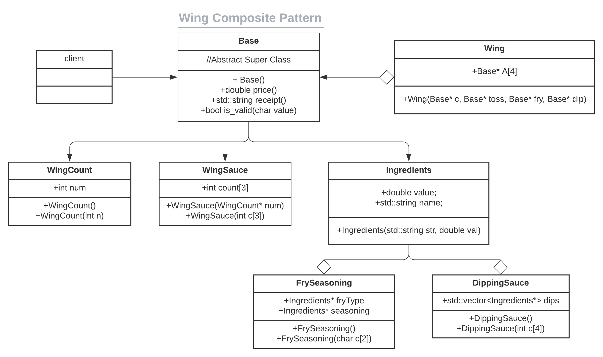
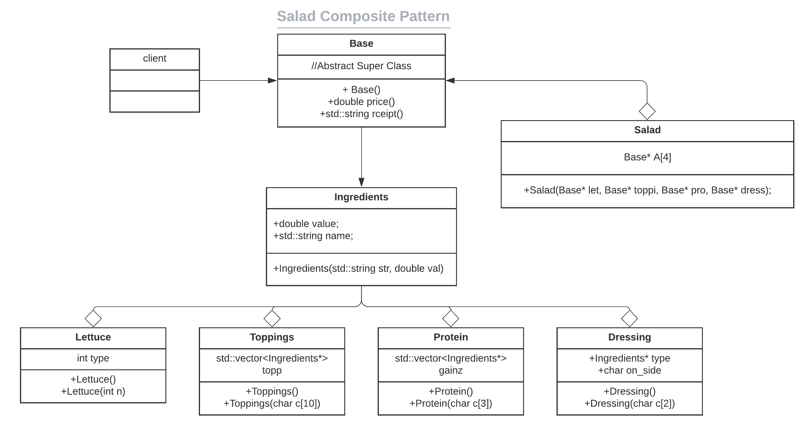

# CS100 Menu Project

> Author(s): Sumachai Suksanguan, Karsten Fields


The two of us plan on creating a Menu Application that will utilize Composite, Decorator, and Strategy Design Patterns.

# Premise

Foodservice is a growing industry, and as restaurants get more and more advanced, so will the technology needed.  We believe that using these patterns to design a functional menu option that allows users to keep better track of their items and food will be much more efficient in the long run. After all, food can be composed of many "smaller" ingredients, and "decorated" as well.  Utilising a Strategy Pattern will allow for more specific implementations of certain functions.

This project will be coded primarily in C++.  The README. will be updated along the way, with all important aspects highlighted during the developmental process.  The program will be tested both by user-input during a demo, and pre-determined character arrays that will populate our constructors.  This will be further discussed in the testing portion of each design patterns implementation.

Our program will utilize a simple interface that involves the implementation of `price()` and `receipt()` accross multiple design patterns.  The first function will return the comprehensive price of the item purchased, while the second will return the string receipt representation of the order.  The functions are described in `base.hpp`

```c++
class Base{
	public:
		//Constructors
		Base(){}
		
		//Pure Virtual Functions
		virtual double price() = 0;
		virtual std::string receipt() = 0;
};
```

# Utilization of Composite Pattern 

Many foods are composed of smaller, more functional foods.  For simplicity, we will limiting the items on our menu to staples at certain restaurants.  In this case, guests will have the option of a Cheeseburger Basket, Wing Basket, or a Salad. For readability purposes, we have made placed all appropriate files into their respective directories.  The `Composite` Directory will contain the `base.hpp` file, along with 3 subdirectories that correspond the the following classes.

## Ingredients

Every single food is composed of Ingredients.  So it makes sense that while `Base` serves as our super class, we would need a much more smaller, and friendly interface.  The smallest aspect of food, a single ingredient.  Our program will constantly be creating `Ingredients` objects, that are used in food construction, all with pre-determined prices and responsibilities.

```c++
class Ingredients : public Base {
	private:
		double value;
		std::string name;
	public:
		Ingredients(std::string str, double val){name = str; value = val;}
		double price(){return value;}
		std::string receipt(){return name;}
};
```
> Note: With `Ingredients` being the smallest interfaceable object, larger objects such as `Veggies` and `Burgers` may recursively implement their `price()` and `receipt()` functions to depict *all* ingredients being used.

### Cheeseburger Basket

Cheeseburgers come in several forms, with them often adding toppings and extras as they please.  With our program, the user will be able to select a Cheeseburger Base that includes: a bun, single burger patty, and cheese.  From there, guests may opt to include the following extras: tomatoes, lettuce, pickles, onions, bacon, an additional patty, an additional slice of cheese, ketchup, and/or mustard.

The declaration for a object of type `Burger` is as follows: `Burger* burgerName = new Burger(Base*, Base*, Base*);`.  The burger is comprised of its base ingredients (Bun, Patty, Cheese), and then extras that are broken down into the following subclasses: `Veggies`, `Extras`, and `Sauce`.  As a result, `Burger`'s implementation of the `price()` function is as follows:

```c++
virtual double price(){
	double sum = 0.00;
	sum = 3.50 + A[0]->price() + A[1]->price() + A[2]->price();
	return sum;
}
```
> Note: Where 3.50 indicates the base price of the burger and A[0], A[1], and A[2] represent the combined prices of the extra ingredients.

```c++
virtual std::string receipt(){
	std::string str;
	str = "PERSONAL BURGER\nADD\n" + A[0]->receipt() + '\n' + A[1]->receipt() + '\n' + A[2]->receipt();	
	return str;
}
```
Example: A Plain Burger would yield the following output:
```
PERSONAL BURGER
ADD
NO VEGGIES
NO EXTRAS
NO SAUCE
```

### Wing Basket

There are so many ways to eat a chicken these days, just as there are as many ways to coat them. The user will be able to select a Chicken Strip Base that will includes: their preffered number of Strips (3/6/9/12), a coating for their strips, fry seasoning, and a dipping sauce.



Much like the `Burger` subclass, this basket is composed of many of the guests preffered choices.  All of these selections are broken down into the following subclasses: `WingCount`, `WingSauce`, `FrySeasoning`, and `Dipping Sauce`.

### Salad

For our guests who would prefer a healthier alternative, our application will allow them to create their own salad.  It is much harder to generalize a salad, so it will mostly be mix and match for our guests.  



As a result, the `Salad` subclass will be composided of the guests: preference of lettuce, additional toppings, protein, and dressing.  Those will be broken down into these subclasses: `Lettuce`, `Toppings`, `Protein`, and `Dressing`.

## Testing Composite Design

Our program will feature tests similar to the tests from `lab-03-composite-pattern` that features the creation of the Larger Ingredient subclasses (`Veggies`, `WingCount`, `WingSauce`, etc) and the direct comparison to static values.  As it is a program designed to be used by a user, we will test it both by the `fun` (main) executable, and the `test` executable.

Notice, that inside the `Burger`, `Wing`, and `Salad` subclasses contain two constructors.  With the first constructor designed for user-input, and the second constructor designed for unit testing.

### Google Testing

```c++
Sauce(char c[3]){
	char input;
			
	input = c[0];
	if(input == 'Y' || input == 'y'){lost.push_back(new Ingredients("KETCHUP", 0));}
	else{}
			
	input = c[1];
	if(input == 'Y' || input == 'y'){lost.push_back(new Ingredients("MUSTARD", 0));} 
	else{}
			
	input = c[2];
	if(input == 'Y' || input == 'y'){lost.push_back(new Ingredients("A1 SAUCE", 0.50));}
	else{}

	if(lost.empty()){lost.push_back(new Ingredients("NO SAUCE", 0));}
}
```
> Note : An array containing `{'Y', 'Y', 'Y'}` would construct an `Extras` object that contains an extra patty, bacon, and extra slice of cheese.

Therefore, our `test.cpp` file contains a multitude of tests that utilize that form of construction, from there, objects are tested by directly comparing them to what the sum of their combined ingredients would be. 

```c++
char array1[3] = {'Y', 'Y', 'Y'};
Extras* test1 = new Extras(array1);
	
EXPECT_DOUBLE_EQ(test1->price(), 4.00);
EXPECT_EQ(test1->receipt(), "EXTRA PATTY\nBACON\nEXTRA CHEESE");
```

Naturally, if we were to test larger objects such as `Burger`, we would have to create all 3 required subclasses in `Veggies`. `Extras`, and `Sauce`, then utilize the exact same concept above:
```c++
TEST(BurgerTest, PlainBurger){
	/*
	
	------ DEFINE SUBCLASSES HERE -------
	
	*/

	Burger* why = new Burger(test1, test2, test3);
	EXPECT_DOUBLE_EQ(why->price(), 3.50);
	EXPECT_EQ(why->receipt(), "PERSONAL BURGER\nADD\nNO VEGGIES\nNO EXTRAS\nNO SAUCE");
}
```
### User Testing

Will be written when implemented and developed.
