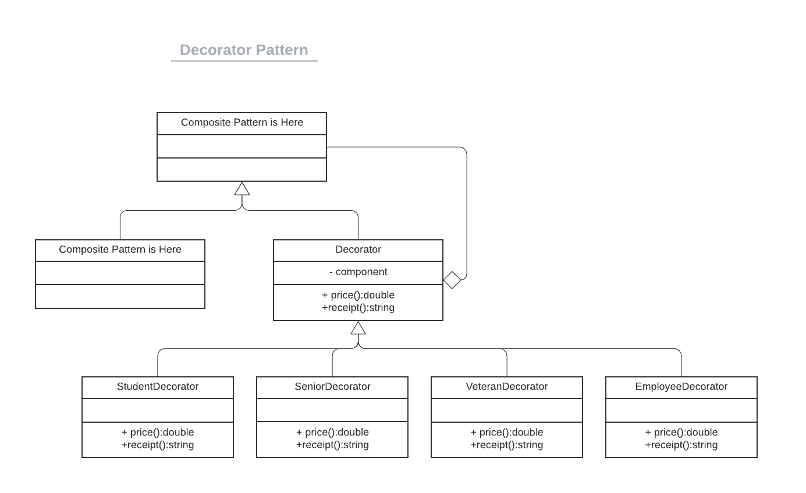
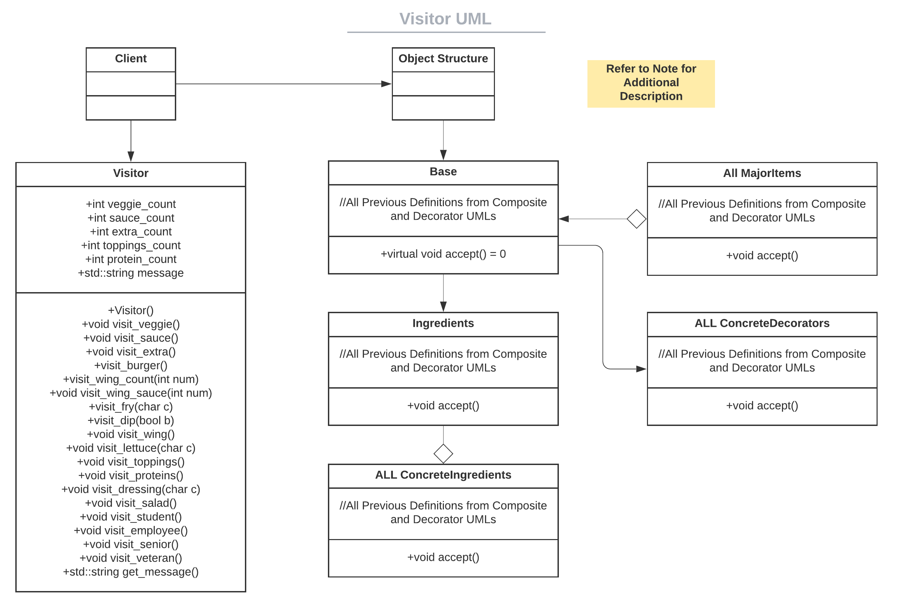

# CS100 Menu Project

> Author(s): Sumachai Suksanguan, Karsten Fields


The two of us have created a Menu Application that utilized Composite, Decorator, and Visitor Design Patterns.

# Premise

Foodservice is a growing industry, and as restaurants get more and more advanced, so will the technology needed.  We believe that using these patterns to design a functional menu/register will allow both users and guest a quicker experience. After all, food is composed of many "smaller" ingredients, and "decorated" as well.  Utilising a Visitor Pattern will allow for more specific messages for our guests at the end of their receipt.

This project will be coded primarily in C++.  The `README.md` will contain relevant informationre regarding Design Pattern explanation and overall implemenation.  The program will be tested both by user-input during a demo, and pre-determined character arrays that will populate our constructors.  This will be further discussed in the testing portion of each design patterns implementation.

Please note, to reduce the amount of clutter at the beginning of files, there is an appropriate `include.hpp` in the root directory that contains all the appropriate `#include "filename"` commands.

Our program will utilize a simple interface that involves the implementation of `price()` and `receipt()` accross multiple design patterns.  The first function will return the comprehensive price of the item purchased, while the second will return the string receipt representation of the order.  The functions are described in `base.hpp`

```c++
class Base{
	public:
		//Constructors
		Base(){}
		
		//Pure Virtual Functions
		virtual double price() = 0;
		virtual std::string receipt() = 0;
};
```

# Utilization of Composite Pattern 

All foods are just composed of smaller foods.  For example, a bowl of spaghetti is composed of noodles, sauce, veggies, and meat.  For simplicity, we will limiting the items on our menu to staples at certain restaurants.  In this case, guests will have the option of a Cheeseburger Basket, Wing Basket, or a Salad. For readability purposes, we have made placed all appropriate files into their respective directories.  The `Composite` Directory will contain the `base.hpp` file, along with 3 subdirectories that correspond to the following classes: `Burger`, `Wing`, and `Salad`.

## Ingredients

Every single food is composed of Ingredients.  So it makes sense that while `Base` serves as our super class, we would need a much smaller, friendlier interface.  The smallest aspect of food, is a single ingredient.  Our program will constantly be creating `Ingredients` objects, that are used in food construction, all with pre-determined prices and responsibilities.

```c++
class Ingredients : public Base {
	private:
		double value;
		std::string name;
	public:
		Ingredients(std::string str, double val){name = str; value = val;}
		double price(){return value;}
		std::string receipt(){return name;}
};
```
> Note: With `Ingredients` being the smallest interfaceable object, larger objects such as `Veggies` and `Burgers` may recursively implement their `price()` and `receipt()` functions to depict *all* ingredients being used.

### Cheeseburger Basket

Cheeseburgers come in several forms, with them often adding toppings and extras as they please.  With our program, the user will be able to select a Cheeseburger Base that includes: a bun, single burger patty, and cheese.  From there, guests may opt to include the following extras: tomatoes, lettuce, pickles, onions, bacon, an additional patty, an additional slice of cheese, ketchup, mustard, and/or A1 Sauce.


The declaration for a object of type `Burger` is as follows: `Burger* burgerName = new Burger(Base*, Base*, Base*);`.  The burger is comprised of its base ingredients (Bun, Patty, Cheese), and then extras that are broken down into the following subclasses: `Veggies`, `Extras`, and `Sauce`.  As a result, `Burger`'s implementation of the `price()` function is as follows:

```c++
virtual double price(){
	double sum = 0.00;
	sum = 3.50 + A[0]->price() + A[1]->price() + A[2]->price();
	return sum;
}
```
> Note: Where 3.50 indicates the base price of the burger and A[0], A[1], and A[2] represent the combined prices of the extra ingredients.

```c++
virtual std::string receipt(){
	std::string str;
	str = "PERSONAL BURGER\nADD\n" + A[0]->receipt() + '\n' + A[1]->receipt() + '\n' + A[2]->receipt();	
	return str;
}
```
Example: A Plain Burger would yield the following output:
```
PERSONAL BURGER
ADD
NO VEGGIES
NO EXTRAS
NO SAUCE
```

### Wing Basket

There are so many ways to eat a chicken these days, just as there are as many ways to coat them. The user will be able to select a Chicken Strip Base that will includes: their preffered number of wings (3/6/9/12), a coating for their wings, fry seasoning, and a dipping sauce.


Much like the `Burger` subclass, this basket is composed of many of the guests preffered choices.  All of these selections are broken down into the following subclasses: `WingCount`, `WingSauce`, `FrySeasoning`, and `Dipping Sauce`.

When it comes to coating their wings, guest may opt for any combination between Buffalo, BBQ, and plain wings. That will determine the `WingSauce` object. 

Guests are then encouraged to select fries to accompany their wings, from their they have the option of Regular Fries, Curly Fries, Half-n-Half, or No Fries at all.  Those respective fries may be then be seasoned with either Sea Salt or Cajun seasoning, or no seasoning at all. These two decisions will impact the `FrySeasoning` object.

Of course, you need something to dip your wings in, so guests may opt for any number of Ranch Dressing or Blue Cheese Dressing portions, which will modify the `DippingSauce` objects.

`Wing`'s pricing is affected by the quantity of wings, sauce combination, fry selection, and whether the guests choose to add a dipping sauce or not.  Therefore, it's `price()` function is a simple arithmetic formula that simply adds all the composed objects.

```c++
virtual double price(){
	double sum = 0.00;
	sum = A[0]->price() + A[1]->price() + A[2]->price() + A[3]->price();
	return sum;
}
```
However, when it comes to wings, there are many combinations, so it's `receipt()` function is not as straightforward.  While the `receipt()` function is simple in implementation, the objects it is composed have unique properties that print our desired order.

Using an input of:
```c++
WingCount* twelve = new WingCount(12);
WingSauce* combo = new WingSauce({6, 6, 0});
FrySeasoning* regCajun = new FrySesaoning({'R', 'C'});
DippingSauce* dipp = new DippingSauce({1, 2, 0, 0});
```
would yield an output of:
```
WING BASKET
12 COMBO WINGS
- 6 BUFFALO
- 6 BBQ
- 0 PLAIN
REG. FRIES w/ CAJUN
+ 2 RANCH(ES)
```

### Salad

For our guests who would prefer a healthier alternative, our application will allow them to create their own salad.  It is much harder to generalize a salad, so it will mostly be mix and match for our guests.  


As a result, the `Salad` subclass will be composided of the guests: preference of lettuce, additional toppings, protein, and dressing.  Those will be broken down into these subclasses: `Lettuce`, `Toppings`, `Protein`, and `Dressing`.

Guests will be able to select their option of `Lettuce` to act as a base to their Salad.  We offer Romaine, Iceberg, Spring Mix, and Kale/Coleslaw Mix.

Salads are often unique, there are a myriad of combinations as guests can mix and match whatever ingredients they want.  Perhaps they want an exorbant number of `Topping`?  No worries, we allow guests to add items such as Grape Tomatoes, Cucucmbers, Corn, Black Beans, Croutons, Eggs, Cheese Blend, Avocado and Diced Bacon! 

If the guests would like some meat in their salad, they are more than welcome to add a `Protein` and select from Grilled Chicken, Grilled Salmon, or our Vegan Alternative, Soy Chicken. 

From there, guests may choose to have their salad feature one of our Signature `Dressing` either in the salad or on the side.  They have the selection of: Ranch, Caesar, Blue Cheese, Baslamic Vinegar & Olive Oil, Southwest, or no Dressing.

As you can see, Guests have the option to putting as much as they can, or absolutely nothing at all.  As a result, the `price()` functions evaluation is simply a composite of all the respective ingredients prices, with one small caveat.  If the total cost of the salad is less than $2.49, the price will automatically be adjusted to $2.49 in order to meet organizational requirements.

```c++
virtual double price(){
	double sum = 0;
	sum = A[0]->price() + A[1]->price() + A[2]->price() + A[3]->price();
	if(sum < 2.49){
		sum = 2.49;
	}
	return sum;
}
```
When ordering a salad, both the guests and the employees preparing it simply want to see what they ordered, and that's it.  As a result, the `receipt()` function will return a string that condenses the entire order into a readable portion of text.

If we were to compose a `Salad` object with the following ingredients:

```c++
Lettuce* spring = new Lettuce('S');
Toppings* myToppings = new Toppings({'Y', 'N', 'Y', 'N', 'Y', 'Y', 'Y', 'Y', 'N'});
Protein* iTry = new Protein({'Y', 'N', 'N'});
Dressing* heh = new Dressing({'S', 'N'})
```
That composition happens to be my ideal salad order, as a result, my receipt would read:

```
PERSONAL SALAD
SPRING MIX WITH
- GRAPE TOMATOES
- CORN
- CROUTONS
- EGG
- CHEESE BLEND
- AVOCADO
ADD
- GRILLED CHICKEN
WITH SOUTHWEST DRESSING
```

## Testing Composite Design

Our program will feature tests similar to the tests from `lab-03-composite-pattern` that features the creation of the Larger Ingredient subclasses (`Veggies`, `WingCount`, `WingSauce`, etc) and the direct comparison to static values.  As it is a program designed to be used by a user, we will test it both by the `fun` (main) executable, and the `test` executable.

Notice, that inside the `Burger`, `Wing`, and `Salad` subclasses contain two constructors.  With the first constructor designed for user-input, and the second constructor designed for unit testing.

### Google Testing

```c++
Sauce(char c[3]){
	char input;
			
	input = c[0];
	if(input == 'Y' || input == 'y'){lost.push_back(new Ingredients("KETCHUP", 0));}
	else{}
			
	input = c[1];
	if(input == 'Y' || input == 'y'){lost.push_back(new Ingredients("MUSTARD", 0));} 
	else{}
			
	input = c[2];
	if(input == 'Y' || input == 'y'){lost.push_back(new Ingredients("A1 SAUCE", 0.50));}
	else{}

	if(lost.empty()){lost.push_back(new Ingredients("NO SAUCE", 0));}
}
```
> Note : An array containing `{'Y', 'Y', 'Y'}` would construct an `Extras` object that contains an extra patty, bacon, and extra slice of cheese.

Therefore, our `test.cpp` file contains a multitude of tests that utilize that form of construction, from there, objects are tested by directly comparing them to what the sum of their combined ingredients would be. 

```c++
char array1[3] = {'Y', 'Y', 'Y'};
Extras* test1 = new Extras(array1);
	
EXPECT_DOUBLE_EQ(test1->price(), 4.00);
EXPECT_EQ(test1->receipt(), "EXTRA PATTY\nBACON\nEXTRA CHEESE");
```

Naturally, if we were to test larger objects such as `Burger`, we would have to create all 3 required subclasses in `Veggies`. `Extras`, and `Sauce`, then utilize the exact same concept above:
```c++
TEST(BurgerTest, PlainBurger){
	/*
	
	------ DEFINE SUBCLASSES HERE -------
	
	*/

	Burger* why = new Burger(test1, test2, test3);
	EXPECT_DOUBLE_EQ(why->price(), 3.50);
	EXPECT_EQ(why->receipt(), "PERSONAL BURGER\nADD\nNO VEGGIES\nNO EXTRAS\nNO SAUCE");
}
```


# Utilization of Decorator Pattern

There are several different groups of people who receive special discounts on their purchases. Such groups include students, senior citizens, veterans, and employees. 

* Students get a 10% discount
* Seniors get a 15% discount
* Veterans get a 20% discount
* Employees get a 50% discount

Naturally, you can't get a discount on something that doesn't exist, so all of our Concrete Decorator implementations must take an object of type `Base` during its initial construction. 



## Implementation of Decorator Pattern

Below is the code for the `EmployeeDecorator` class:

```c++
#ifndef __EMPLOYEEDECORATOR_HPP__
#define __EMPLOYEEDECORATOR_HPP__

#include "../base.hpp"

class EmployeeDecorator : public Base {
        private:
                Base* b;
        public:
                EmployeeDecorator(Base* b){this->b = b;}
                virtual double price(){return b->price() - (0.5 * b->price());}
                virtual std::string receipt(){return "Employee Order:\n" + b->receipt();}
};

#endif // __EMPLOYEEDECORATOR_HPP__
```

> Note: All four concrete implementations of the Decorator feature very similiar `price()` and `receipt()` functions with the sole distinction being the amount of the discount, and appropriate header for the receipt.

By using the code above and proving this input: 

```c++
WingCount* twelve = new WingCount(12);
WingSauce* combo = new WingSauce({6, 6, 0});
FrySeasoning* regCajun = new FrySesaoning({'R', 'C'});
DippingSauce* dipp = new DippingSauce({1, 2, 0, 0});

Wing* basket = new Wing(twelve, combo, regCajun, dipp);
EmployeeDecorator* EmpDiscount = new EmployeeDecorator(basket);
```
would yield an output of:

```
Employee Order:
WING BASKET
12 COMBO WINGS
- 6 BUFFALO
- 6 BBQ
- 0 PLAIN
REG. FRIES w/ CAJUN
+ 2 RANCH(ES)
```

> Note: **Employee Order** has been placed at the beginning of the order to indicate that an Employee has purchased that meal.

## Testing Decorator Design

Decorator pattern use the objects that were passed in during construction and modify them.  Therefore, our tests for the decorator design pattern will utilize the objects that were previously created during composite pattern tests.  However, this time we must expect a reduction in price and the addition of a header at the beginning of the receipt.

Here is an example test using the Google test suite:

```c++
TEST(Decorators, EmployeeDecorator){
        int sauce[3] = {0, 9, 0};
	char fries[2] = {'R', 'S'};
        int dipp[4] = {1, 4, 0, 0};
        
	WingCount* nine = new WingCount(9);
	WingSauce* bbq = new WingSauce(sauce);
	FrySeasoning* regSeaSalt = new FrySeasoning(fries);
	DippingSauce* dips = new DippingSauce(dipp);
	
	EXPECT_DOUBLE_EQ(nine->price(), 9.00);
        EXPECT_DOUBLE_EQ(bbq->price(), 0.90);
	EXPECT_DOUBLE_EQ(regSeaSalt->price(), 1.59);
	EXPECT_DOUBLE_EQ(dips->price(), 1.00);
	EXPECT_EQ(nine->receipt(), "9");
        EXPECT_EQ(bbq->receipt(), "BBQ WINGS");
        EXPECT_EQ(regSeaSalt->receipt(), "REG. FRIES w/ SEA SALT");
        EXPECT_EQ(dips->receipt(), "+ 4 RANCH(ES)");                                                                                                                                       
	Wing* basket = new Wing(nine, bbq, regSeaSalt, dips);
	EXPECT_DOUBLE_EQ(basket->price(), 12.49);
	EXPECT_EQ(basket->receipt(), "WING BASKET\n9 BBQ WINGS\nREG. FRIES w/ SEA SALT\n+ 4 RANCH(ES)");
	
	EmployeeDecorator* EmpDiscount = new EmployeeDecorator(basket);
        EXPECT_EQ(EmpDiscount->price(), 6.245);
	EXPECT_EQ(EmpDiscount->receipt(), "Employee Order:\nWING BASKET\n9 BBQ WINGS\nREG. FRIES w/ SEA SALT\n+ 4 RANCH(ES)");
} 
```

# Utilization of Visitor Pattern

After a guest orders some food, there tends to a brief waiting period.  Most businesses want to use that time to market their other products and ensure that the guests attention is focused on the business and what they could potentially buy next.  After all most establishments fill their dining halls to the brim with advertisements for other products.  At the bottom of the receipt, each guest will receive a message based on the content of their order. By utilizing the `Visitor` class and member variable `std::string message`, we return an amusing message for the guest, filled with puns and suggestions.



> Note 1: The term `All ConcreteIngredients` refers to all subclasses that have inherited from type `Base`, meaning `Veggies`, `Extras`, `Sauce`, `WingCount`, `WingSauce`, `FrySeasoning`, `DippingSauce`. `Lettuce`, `Toppings`, `Protein`, `Dressing`. 

> Note 2: The term `All MajorItems` refers to objects of type `Burger`, `Wing`, and `Salad`.

> Note 3: The term `All ConcreteDecorators` refers to the four concrete decorators implemented: `Student Decorator`, `SeniorDecorator`, `VeteranDecorator`, and `EmployeeDecorator`.

## Accept

In order to implement these changes, we had to make some changes to our initial `base.hpp` file.  By including the pure virtual `accept()` function in the declaration, we made it so that every single object of type `Base` is able to interact with our visitor.

```c++
class Base{
	public:
		Base(){}
		virtual double price() = 0;
		virtual std::string receipt() = 0;
		bool is_valid(char value){return (value != 'Y' && value != 'y' && value != 'N' && value != 'n');}
		
		//NEW
		
		virtual void accept(Visitor* v) = 0;
};
```
Each `accept()` function must take in an object of type `Visitor` and then utilize that object in a certain manner.  Each instance of an `Ingredient`, from `Veggies` to `Dressing` has an overloaded `accept()` function that calls its appropriate `visit_member()` function.  Please note that for veribility purposes, some `visit_member()` functions require parameters to help determine the appropriate message.

## Visit

So the `accept()` function calls a `visit_member()` function, alright what now?  As you can see below, there are several functions that have specific names.  Naturally, the `Veggies` object will interact using the `visit_veggie()` function, and the `Burger` object will interact using the `visit_burger()` object.

```c++
class Visitor{
	private:
		int veggie_count;
		int sauce_count;
		int extra_count;
		
		int toppings_count;
		int protein_count;
		
		std::string message;
	public:
		Visitor();
		
		void visit_veggie();
		void visit_sauce();
		void visit_extra();
		void visit_burger();
		
		void visit_wing_count(int num);
		void visit_wing_sauce(int num);
		void visit_fry(char c);
		void visit_dip(bool b);
		void visit_wing();
		
		void visit_lettuce(char c);
		void visit_toppings();
		void visit_proteins();
		void visit_dressing(char c);
		void visit_salad();
		
		void visit_student();
		void visit_employee();
		void visit_senior();
		void visit_veteran();
		
		std::string get_message();

};
```
Now what exactly do these functions do? Despite there being a myriad of them, they all have similar properties.  Analyze what the guest ordered, and create a message based on that order.  
## Get Message

Our visitor utilizes a strategic combination of `visit_member()` and `accept()` to generate a message based on the guests selection.  If a guest ordered wings and selected to coat them in only Buffalo Sauce, our visitor pattern will suggest that next time they order some BBQ as well.  Perhaps our guest ordered a plain salad with no toppings, the visitor function will compose a message that suggests adding some of our many toppings the next time they visit.

Using an input of
```c++
Lettuce* spring = new Lettuce('S');
Toppings* myToppings = new Toppings({'Y', 'N', 'Y', 'N', 'Y', 'Y', 'Y', 'Y', 'N'});
Protein* iTry = new Protein({'Y', 'N', 'N'});
Dressing* heh = new Dressing({'S', 'N'})

Salad* chai = new Salad(spring, myToppings, iTry, heh);
EmployeeDecorator* mealPerk = new EmployeeDecorator(chai);
```
would construct my personal favorite salad, with an employee discount.  If we run:
```c++
Visitor* vis = new Visitor();
mealPerk->accept(vis);

std::cout << mealPerk->receipt() << std::endl << vis->get_message();
```

it would yeild an output of:
```
Employee Order:
PERSONAL SALAD
SPRING MIX WITH
- GRAPE TOMATOES
- CORN
- CROUTONS
- EGG
- CHEESE BLEND
- AVOCADO
ADD
- GRILLED CHICKEN
WITH SOUTHWEST DRESSING

Caution: Spring Mix does not bring forth Spring
South West...wait where are we?
Why not add just a little bit more!
```

## Testing Visitor Design

Naturally, a message concerning an order should be done at the end of an order, when everything is already properly created.  Therefore, our we will be testing our `Visitor` class by having it visit Objects that have been created by our Composite and Decorator Designs respectively.

If we reuse some tests from the above designs, and add in an object of type `Visitor`, we can test the functionality of the visit by checking to see if `visitor->get_message()` returns the correct message.

```c++
TEST(VisitorTest, ComboBurgerNoDecorator){
	char array1[4] = {'Y','Y','Y','Y'};
	Veggies* test1 = new Veggies(array1);

	EXPECT_EQ(test1->price(), 0);
	EXPECT_EQ(test1->receipt(), "TOMATOES\nLETTUCE\nPICKLES\nONIONS");

	char array2[3] = {'N', 'N', 'N'};  
        Extras* test2 = new Extras(array2);
	
	EXPECT_DOUBLE_EQ(test2->price(), 0.00);
	EXPECT_EQ(test2->receipt(), "NO EXTRAS");

	char array3[3] = {'Y','Y','N'};
	Sauce* test3 = new Sauce(array3);

	EXPECT_DOUBLE_EQ(test3->price(), 0);
	EXPECT_EQ(test3->receipt(), "KETCHUP\nMUSTARD");
	
	Burger* bigMac = new Burger(test1, test2, test3);
	EXPECT_DOUBLE_EQ(bigMac->price(), 3.50);
	EXPECT_EQ(bigMac->receipt(), "PERSONAL BURGER\nADD\nTOMATOES\nLETTUCE\nPICKLES\nONIONS\nNO EXTRAS\nKETCHUP\nMUSTARD");
	
	Visitor* vis = new Visitor();
	
	bigMac->accept(vis);
	std::string mes = vis->get_message();
	
	EXPECT_EQ(mes, "You added some toppings, why not take that extra step and add more!");

}
```
> Note: In this object here, the burger we created had 6 out of a possible 10 condiments.  As a result, our visitor suggests to the guest that next time they should add just a teensy bit more.

# Main.cpp

Our program has been subjected to a myriad of testing that has put the program through multiple combinations of different foods with their own respective ingredients and the appropriate decorators. However, the only ensure that it works, it to see if it runs when given user input.  Therefore, the program acts by continously asking the user questions.

The user interaction was implemented with 'main.cpp' where we go through a sequence of decisions to arrive at the final order. The sequence is as follows:

1. Ask if the user belongs to a specific group, such as students, or veterans.
	* That information is then stored for a later calculation.
2. Ask the user what base item they want, such as a salad or basket of wings.
3. Ask the user what specific ingredients they want on their base food item.
4. The item is "decorated" with the appropriate Discount modifier from Step 1.
5. The `visit` and `accept` functions are called to create the users personalized message.
6. Output price, receipt, and message

Following the user interaction, the user group type is used to calculate a discount, if any, and then outputs the total price and receipt. From there the `visit` and `accept` function is used to create a personalized message for the user that.

When Prompted, and entering this input:
```
Greetings!
Are you:
a student? - Enter 'u'
55 or older? - Enter 's'
a veteran? - Enter 'v'
an employee? - Enter 'e'
none of the above? - Enter 'o'
Enter 'q' to quit.

u

Menu:
1. Cheese Burger
2. Wings
3. Salad
Please enter the number of the food item you want.
2
How many wings? ($1.00 each) [3/6/9/12]: 3
Wing Sauce:
How Many Buffalo Wings would you like? ($0.10 each) [1 - 3]: 1
How Many BBQ Wings would you like? ($0.10 each) [1 - 2]: 1
How many Plain Wings would you like? (FREE) [1 - 1]: 1
Seasoning:
Would you like:
 - REG. FRIES ($1.59)[R]
 - CURLY FRIES ($1.99)[C]
 - HALFSIES FRIES ($1.79)[H]
 - NONE (N)
PLEASE ENTER (R/C/H/N): r
Please select a fry seasoning:
- SEA SALT (S)
- CAJUN (C)
- NONE(N)
PLEASE ENTER (S/C/N): s
Dipping sauce:
Would you like any dipping sauces? (Y/N): y
Ranch? ($0.25) [Y/N]:y
Quantity? (Please enter a number): 1
Blue Cheese? ($0.25) [Y/N]: n
```
> Note : In this case the input is u-3-1-1-1-r-s-y-y-1-n

will yield the following output:

```
Your total is: $4.54

Student Order:
WING BASKET
3 COMBO WINGS
- 1 BUFFALO
- 1 BBQ
- 1 PLAIN
REG. FRIES w/ SEA SALT
+ 1 RANCH(ES)
Only 3? Let's shoot for 6!
Buffalo, BBQ, and Plain?  Let's coat all of them next time!
Next time try our curly fries!
Don't get lost in the (dipping) sauce
We love Wing Lovers, but have you met our Burgers and Salads?
Good Luck with Finals!
```
> Note: Since the guest is a student, the Receipt prints "Good Luck with Finals!"

# Conclusion

Our project is the culmination of Composite, Decorator, and Visitor Design patterns.  Each design pattern uses the pattern that came before it, our implementation is the most efficient we could do at the moment.  Of course, there are multiple ways we can improve the project such as:

* Allowing Multiple Item Types (Multiple Burgers, Burgers & Wings)
* A loyalty program of sorts
* A Readable GUI that actually outputs a receipt.

However, this is our current pride and joy.  Please enjoy.
